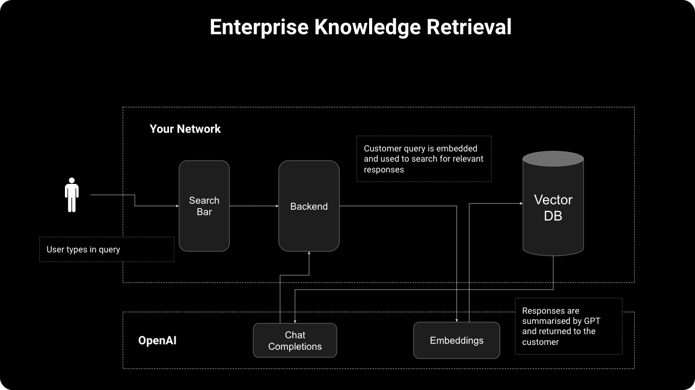
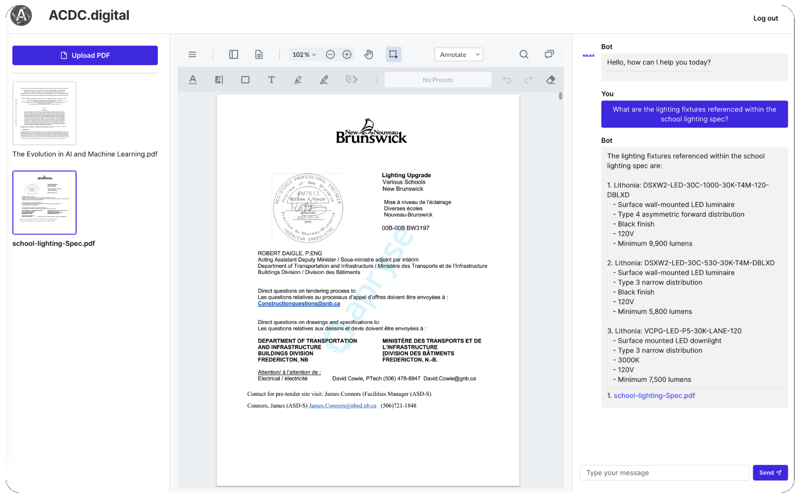

# 

Legacy ReadMe is in the Wiki. 

**ACDC.digital is an artifical-intellegence research agency putting our adopted learning into practice to enable small businesses insights to advantages they wouldn't have known about otherwise.**

**Introduces:** 

 
 

Solomon is an intuitive machine learning model that is design to adapt artifical intellegence to the various needs of small businesses.   [1](#fn1) 

Solomon is quickly becoming more and more adaptable to natural business processes. Today, Solomon is now able to ingest large quantities of .pdf, and .txt files from a single directory. We can also analyze .csv files for financial purposes, and text sentiment analysis which enables Solomon to determine poignant examples of positive, neutral, and poor financial habits. These insights can be visualized in 2D and 3D charts, and the results can be used for further processing tasks such as database formulas for integrating this information with cross-departmental information to get further insight into the hollistic nature of the business.   [2](#fn2) 

Solomon version 3 now includes an engine module to serve embeddings without having to call the parallel processing file. Instead, the engine is now hard-coded into the module, and thus far, has proven significant results. Today's benchmarks include ingesting of 1,800+ pages and generating their text embeddings in under 3-minutes. This is our most impressive model engine, and proves to be an exciting of time of development as production days appear in the near future.   [4](#fn4) 
 
 

## The Brand
"Unlock a New Level of Success: VIP Access to acdc.digital's AI Revolution"

**The Message:**  
For years, we've had the privilege of helping small businesses like yours take the quantum leap.

🔒 **Exclusive Access:** We're creating breakthrough AI solutions, and we wanted you to be among the first to try. These are game-changing features and they're going to revolutionize the way small businesses operate.  
🌟 **Meet Solomon:** Your 24/7 virtual strategist. What if I told you Solomon could predict market trends before your competition even catches wind of them? Well, he can.  
⚡ **InfoPulse 2.0:** Staff training just entered the 21st century. Imagine slashing onboarding times in half and boosting productivity from day one. It's not just possible; it's a guarantee.  
📊 **FinVue Analyzer:** What if your financial data could talk? FinVue listens and deciphers the complex language of numbers to offer insights that drive profits.  
👥 **ExpertiseOnDemand:** Think of it as your personal "Justice League" of business consultants—available at your fingertips.  
⏳ **Limited Time:** As our beta operational model expands, we'll keep our prices low for our pioneering clients.  
🏆 **Real Results:** Lifetime guarantee.  
📞 **Next Steps:** Are you ready to join the revolution? Let’s schedule a 15-minute meeting next week. 

**The future starts now. Will you seize it?**

 

## Our Architecture

  

  

**Executive Sumamary:**  
Our project-app has been initiated via React and Next.js. We've created the User authentification with Clerk, and we've identified a potential integration with Supasbase. Following, we've created a Neon-db which is currently being used to hold the user-data collected from sign-in, document, and chat management. We're currently using AWS for file loading and storage. 

 

## Introduces MITP

The Solomon Architecture is based on advanced retrieval techniques, proprietary and developed by ACDC.digital in order to personalize assistant-based models for the company that they will be integrated with. This Architecture is called Machine Information Training & Personalization (MITP). The theoretical objective of our architecture is to determine how various inputs/modalities are interlinked in order to exploit those advantages for extremely personalized concepts that would not have been otherwise able to be discovered. 

The Solomon architecture takes advantage of many libraries in order to advance the skills of the model. Each skill currently has very refined code modules which act independently, and as solutions for integration arise, will be embedded into the master-model. Some features of our architecture include advanced visualizations from matplotlib, advanced sentiment analysis for text in both general documentation, but now including financial data. Other features include web-search, and market research capabilities. All branches of very poignant libraries in which more information can be found within our prospectus (link in the footnotes at the bottom).   [3](#fn3) 

The main architecture design uses traditional ml-techniques in combination with today's advanced artificial intellegence, to abstract and transform user data in such a way that vectorstorage is enabled. In this proces, we ingest large quantities of data, in multiple formats, which can then be further analyzed in advanced retrieval methods. In the front we use the React/Next.js libraries to develop user-friendly and information-forward web application. User Oauth and user-db are Supabase, along with a variety of other cool features. Our back-end is FastAPI for communicating with our model, then fine-tuned OpenAI models that are also trained on the retrieval-data. I believe this method will highly benefit the results as the database is able to scale. That is based on the information accumulated to date. We are betting this works better than we expect and cannot wait to see the results further down the line. 
 
 

## Intended project structure 

**Enterprise Grade Loaders: +2,000 pages in minutes...**

 

**Professional GUI ith performant document mark-up techniques. Review, approve, markup, download, comment, and share files.**

 

## Bibliography

| Refereence                                                                                                                         | Link                                                                                                                                     | Date     |
|--------------------------------------------------------------------------------------------------------------------------------|-------------------------------------------------------------------------------------------------------------------------------------------|----------|
| Review best-practices, field-guides, and more with OpenAI CookBook                                                             | [The OpenAI Cookbook shares example code for accomplishing common tasks with the OpenAI API](https://github.com/openai/openai-cookbook) | 2021 Oct |
| Complete in-depth Tutorial on Front-End Development for Solomon-App                                                             | [Build and Deploy a Full Stack AI SaaS w/ Next JS 13, DrizzleORM, OpenAI, Stripe, TypeScript, Tailwind](https://www.youtube.com/watch?v=bZFedu-0emE&t=3452s&ab_channel=ElliottChong) | 2023 Sept |
| Chat-UI and Ragstack Inspiration                                                                                                 | [Deploy a private ChatGPT alternative hosted within your VPC. Connect it to your organization's knowledge base and use it as a corporate oracle. Supports open-source LLMs like Llama 2, Falcon, and GPT4All.](https://github.com/psychic-api/rag-stack) | 2023 July |

##
<a name="fn1">1</a>: Initial architecture design is based on: 🧺 RAGstack, Clerk, Drizzle-ORM   
<a name="fn2">2</a>: Statement of Progress, September 16, 2023.  
<a name="fn3">3</a>: Link to Prospectus (wip)  
<a name="fn4">4</a>: Statement of Progress, September 19, 2023. 

 

  <a href="https://twitter.com/psychicapi" target="_blank">
    
  <a href="https://twitter.com/ClerkDev" target="_blank">
    
  

